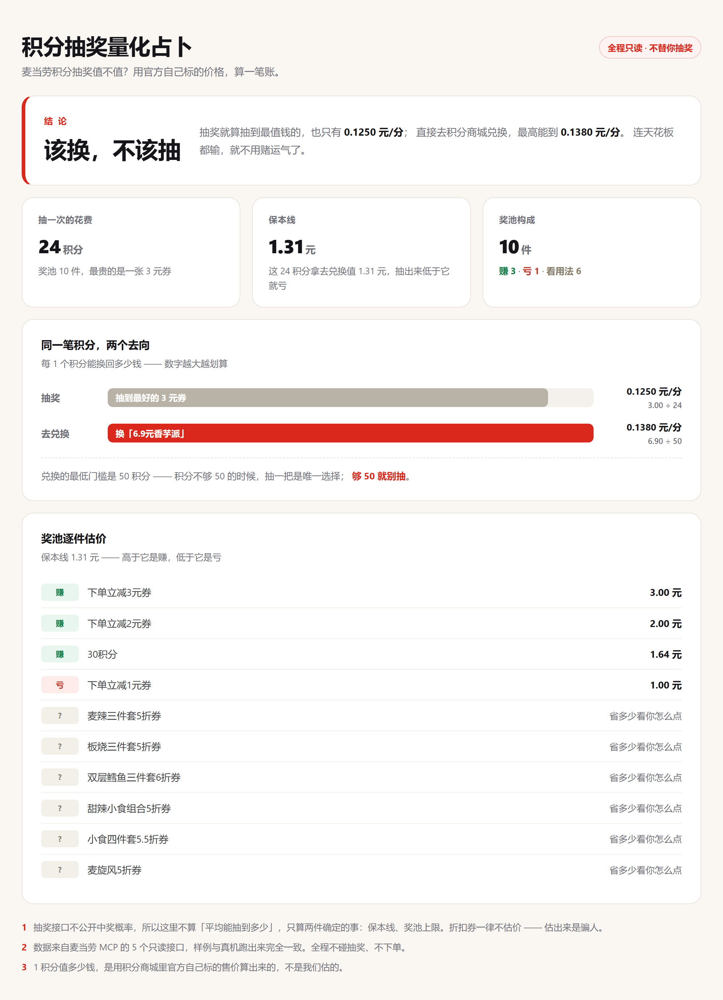

# 积分抽奖量化占卜

> 麦当劳的积分，是拿去抽奖，还是直接兑换？
> 这个工具用**官方自己标的价格**算给你看。



---

## 一句话结论

拿 2026-10-09 的真实数据跑出来是这样：

| | 每 1 积分能换回 | 怎么算的 |
|---|---|---|
| **去积分商城兑换** | **0.1380 元** | 50 积分换一份「6.9元香芋派/菠萝派任选」 |
| **拿去抽奖** | 0.1250 元 | 花 24 积分，抽到最值钱的「下单立减3元券」 |

抽奖**连「抽到最好的」都跑不赢直接兑换** —— 所以结论是：该换，不该抽。

---

## 它回答三个问题

**1. 1 积分值多少钱？**

拿积分商城里现在还能换的商品，每件的「售价 ÷ 所需积分」，取中位数当基准。
用的是麦当劳自己标的售价，不是我们估的。

**2. 抽一次亏不亏？**

抽一次花 24 积分。这 24 积分如果拿去兑换值 1.31 元 —— 这就是**保本线**。
然后奖池 10 件逐件估价，标出每件是「赚」「亏」还是「看用法」。

**3. 该抽，还是该换？**

比"天花板"：抽奖最好的情况 vs 兑换最好的档。谁高听谁的。

---

## 30 秒上手

```bash
# 不用 Token、不联网 —— 用内置的真实样例数据直接跑
python run.py

# 连真实麦当劳 MCP（只读）
python run.py --live --token 你的Token

# 输出 JSON，给网页或脚本用
python run.py --json

# 看看服务端提供哪些 MCP 工具
python run.py --tools --token 你的Token
```

**零依赖** —— 只用 Python 标准库，Python 3.8 以上直接跑，不用 pip install 任何东西。

### Token 怎么给

最省事的是 `--token`，写在命令行上，**跟当前是哪个 shell 无关**：

```bash
python run.py --live --token 你的Token
```

想用环境变量也行，但**注意不同 shell 的写法不一样**：

| 你在哪个终端 | 怎么写 |
|---|---|
| `cmd.exe` | `set MCD_MCP_TOKEN=你的Token` |
| PowerShell | `$env:MCD_MCP_TOKEN="你的Token"` |
| Git Bash / macOS / Linux | `export MCD_MCP_TOKEN=你的Token` |

> ⚠️ **Windows 上最常见的坑**：在 **PowerShell** 或 **Git Bash** 里敲 `set MCD_MCP_TOKEN=xxx`
> 是**不会设置环境变量的** —— 它不报错、不提示，静静地把这行吃掉，
> 看着像成功了，其实 `$env:MCD_MCP_TOKEN` 仍然是空的。
> 只有 `cmd.exe` 认 `set` 这个写法。遇到 `[出错] 没拿到 MCP Token` 时，
> 直接改用 `--token`，或者换到 `cmd.exe` 里跑。

---

## 报告长这样

```
==================================================================
  积分抽奖量化占卜 · 2026-10-09
  数据来源：麦当劳 MCP 实时数据（只读）
==================================================================

【一】1 积分到底值多少钱？

  拿积分商城里现在还能换的 7 件东西算，每件都标着售价和积分：

    最划算   6.9元香芋派/菠萝派任选         1 分 = 0.1380 元
    最差     21.9元巨无霸可乐组合           1 分 = 0.0274 元

  取中间档当基准：1 积分 ≈ 0.0545 元

【二】抽一次，亏不亏？

  活动：麦麦积分抽奖　一次 24 积分　奖池 10 件

  这 24 积分如果直接拿去兑换，值 1.31 元。
  → 所以抽出来的东西，至少值 1.31 元才算不亏。

  奖池逐件估价：

    [赚] 下单立减3元券                  3.00 元
    [赚] 下单立减2元券                  2.00 元
    [赚] 30积分                         1.64 元
    [亏] 下单立减1元券                  1.00 元
    [?] 麦辣三件套5折券                省多少看你怎么点，没法估
    ...

  数一下：赚 3 件、亏 1 件、看用法 6 件。

【三】该抽，还是该换？

  抽奖（最好情况）抽到「下单立减3元券」　3.00 ÷ 24 = 0.1250 元/分
  兑换（最好档）  「6.9元香芋派/菠萝派任选」　0.1380 元/分

  → 结论：换。
    抽奖就算抽到最值钱的，也只有 0.1250 元/分，还不如直接兑换的 0.1380 元/分。

【四】我的积分

  可用 0 分 · 累计 267.1 分 · 已过期 267.1 分
  抽一次要 24 分 —— 现在不够，还差 24 分。

【五】今天适合抽吗？

  不宜抽
  · 积分只有 0，不够抽一次（要 24），先去攒分吧。
  · 今天有 14 项活动在跑，但不影响上面的比价结论。
  · 抽奖就算抽到最值钱的，也只有 0.1250 元/分，还不如直接兑换的 0.1380 元/分。
```

---

## 为什么不算「期望值」

**因为官方不给概率。**

`query-lottery-info` 返回的只有奖品清单 —— 名称、图片、类型，**没有中奖率**。
那些号称能算"抽奖期望值"的工具，要么自己编概率，要么拿假设值硬套，
算出来的数字看着精确，其实是算命。

所以这里只算两个**确定**的东西：

- **保本线**：花掉的积分，直接拿去兑换值多少钱
- **奖池上限**：奖池里最值钱的那件值多少钱

只要「上限」打不过「兑换最好档」，就没有任何理由去赌 ——
**这个论证不需要概率，所以它站得住。**

## 折扣券为什么不估价

奖池 10 件里有 6 张是 5 折 / 5.5 折 / 6 折券。
省多少钱取决于你点什么、点多少 —— 硬要估就得先假设你买什么，那结论就是假的。
所以一律标「看用法」，宁可不答，也不编。

---

## 用到哪些 MCP 能力

| 工具 | 用来干什么 |
|---|---|
| `query-lottery-info` | 抽奖活动：一次花多少积分、奖池有哪些奖品 |
| `mall-points-products` | 积分商城商品 + 售价 → 算出「1 积分值多少钱」（**全项目的锚**） |
| `query-my-account` | 我的可用积分、累计积分、即将过期积分 |
| `query-my-prizes` | 我的抽奖记录 |
| `campaign-calendar` | 今天有哪些活动在跑 |

**五个全是只读查询。**

刻意**不调用** `draw-lottery`（抽奖，花积分）和 `create-order` / `mall-create-order`（下单，花钱）——
算账的事交给工具，按不按那个按钮，你自己决定。
这条边界写在 `mcd_quant/live.py` 的白名单里，并有单测守着（`TestSafety`）。

---

## 目录结构

```
mcd-lottery-quant/
├── run.py                    命令行入口
├── mcd_quant/
│   ├── client.py             MCP 客户端（Streamable HTTP，仅标准库）
│   ├── live.py               线上抓取 + 只读工具白名单
│   ├── engine.py             核心计算：积分价值、保本线、该抽还是该换
│   ├── report.py             把人话打印出来
│   └── sample.py             内置样例（2026-10-09 真实抓取，非编造）
├── demo/index.html           演示页（README 那张图就是它）
├── docs/demo-screenshot.png  演示页截图
├── tests/test_engine.py      45 项单测，全部离线可跑
├── SKILL.md                  WorkBuddy 技能定义
├── MCP_INTEGRATION.md        MCP 接入细则、调用流程、踩过的坑
└── workbuddy.md              用 WorkBuddy 复现这个项目的完整步骤
```

---

## 跑测试

```bash
python tests/test_engine.py
```

45 项，覆盖：金额解析、过期商品过滤、中位数计算、奖品分类、保本线、
比价结论、报告渲染、Token 取值容错，以及**两条合规检查**（白名单里绝不能出现会花钱的工具）。

全部离线，不联网、不消耗任何真实积分。

---

## 数据说明

`mcd_quant/sample.py` 里存的是 **2026-10-09 从真实麦当劳 MCP 原样抓下来的响应**，
字段名和值一字未改（只裁掉了积分商城列表里用不到的图片地址和卖点文案）。

所以**样例模式和真机模式跑出来的结论完全一致** —— 这不是巧合，是设计：
两条路共用同一套转换函数，真机只是把数据源换成了线上接口。

---

## 许可

MIT，见 [LICENSE](LICENSE)。
